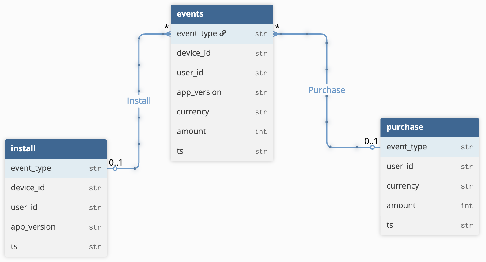

<div id="top">

<!-- HEADER STYLE: CLASSIC -->
<div align="center">


<em>A lightweight event processing and monitoring service built with FastAPI and Python.</em>

<!-- BADGES -->


</div>
<br>

---

## Table of Contents

- [Overview](#overview)
- [Features](#features)
- [Project Structure](#project-structure)
- [Getting Started](#getting-started)
  - [Run with Docker](#run-with-docker-recommended)
  - [Run locally](#run-locally-without-docker)
  - [Tests & Demo](#Tests)
  - [Troubleshooting](#troubleshooting)
- [Acknowledgments](#acknowledgments)
- [Notice](#Notice)
---

## Overview

This **project** is a simple, modular pipeline for **ingesting, processing, and exposing event data** using **FastAPI** and **Pydantic**.  
It’s intentionally minimal—suitable as a technical assignment.

---

## Features

- **FastAPI backend** for serving event data via REST.  
- **Pydantic schemas** for validation.  
- **Pytest** scaffolding for basic tests.  
- **Containerized** with Docker for one-command startup.  
- **Snowfloake /Data Modeling** Events are stored raw with `currency` and `amount`. A downstream ETL can join with daily FX rates to derive `amount_usd`. 

---

## Project Structure

```sh
└── stillfront/
    ├── README.md
    ├── demo.py
    ├── kit
    │   ├── __init__.py
    │   ├── client.py
    │   └── events.py
    ├── requirements.txt
    ├── service
    │   ├── __init__.py
    │   ├── app.py
    │   ├── schemas.py
    │   └── sink.py
    └── tests
        └── basic_test.py
```

---

## Getting Started

### Run with Docker (recommended)

**Prerequisites:** Docker and Docker Compose.

1. **Start the service:**

```bash
docker-compose up --build
```

*(if you use the new CLI: `docker compose up --build`)*

2. **Open the API:**

- Swagger UI → [http://localhost:8000/docs](http://localhost:8000/docs) 

3. **In terminal try dummy events:**

```bash
# to send a purchase event
curl -s -X POST http://localhost:8080/collect \
   -H "Content-Type: application/json" \
   -d '{"event_type":"purchase", "user_id":"20031", "currency": "AED","amount": 120 }'


# tosend an install event
curl -s -X POST http://localhost:8080/collect \
   -H "Content-Type: application/json" \
   -d '{"event_type":"install", "device_id":"device 2", "user_id":"20031", "app_version": "1.1","ts": "2025-xx-xx@xx:xx:xx" }'
```
#### The output will appear in the `output/` folder, and you will also receive a message like: `{"status":"ok","id":"c8811194-0727-473a-b4ec-d5c40f90d7f2"}`
---

### Run locally (without Docker)

**Prerequisites:** Python 3.9+ and pip.

1. **Create and activate a virtual environment:**

```bash
python3 -m venv venv
source venv/bin/activate
```

2. **Install dependencies:**

```bash
pip install -r requirements.txt
```

3. **Run the service:**

```bash
uvicorn service.app:app --reload
```

Then open → [http://localhost:8000/docs](http://localhost:8000/docs)

### SDK Example
```python
from kit import Client, AppInstall

cli = Client(base_url="http://localhost:8000")
cli.send(AppInstall(device_id="macbook pri", user_id="hermann_12345"))
```

---

### Tests

#### to test the process, you can try following code. i deveoped 4 basic tests only.
- **Health check**:
  ```
  python3 -m pytest -q tests/basic_test.py::test_health
  ```
- **Install flow test**:
  ```
  python3 -m pytest -q tests/basic_test.py::test_install_flow
  ```
- **Purchase validation**:
  ```
  python3 -m pytest -q tests/basic_test.py::test_purchase_ok
  ```
- **Purchase OK**:
  ```
  python3 -m pytest -q tests/basic_test.py::test_purchase_validation
  ```

### Demo
Execute `demo.py` in root floder which produce 2 dummy event for each category.

---

### Troubleshooting

- **Check logs:**

```bash
docker-compose logs -f
```

- **Check port mapping:**

```bash
docker ps
```

You should see something like:

```
0.0.0.0:9000->8000/tcp
```

Then open → [http://localhost:9000/docs](http://localhost:9000/docs)

- **If `127.0.0.1` doesn’t work:**

Use → [http://localhost:8000/docs](http://localhost:8000/docs)

---

## Acknowledgments

- This project is deveoped by [Hermann Samimi](https://github.com/HermannSamimi) as a case study for the Analytics Engineer role.
- Security (auth/authz, secrets handling, etc.) is out of scope for this task, but in a real system the API would include authentication and use environment variables for sensitive configuration.


---

## Notice

This repository was developed as part of a **technical assignment** provided by Stillfront for evaluation purposes.  
It is not an official Stillfront product and should be considered a demonstration project only.  

The Stillfront company logo shown above is © Stillfront Group AB and is used here **for illustrative purposes only** to indicate the context of the assignment.  
All rights to the logo and trademarks remain with their respective owner.

<div align="right">

[![][back-to-top]](#top)

</div>

[back-to-top]: https://img.shields.io/badge/-BACK_TO_TOP-151515?style=flat-square
